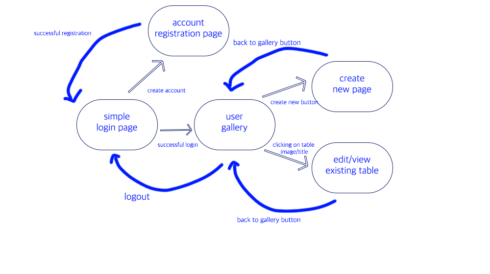

# Aesthetic table generator

## Overview

Aesthetic table is essentially collages of images that is visually pleasing to a viewer.
One can make it in according to their mood, status, or even as a tribute to other people.

This app allows user to generate 9-grid collage images by
* auto generation through Unsplash API
* manually uploading images

and store it in gallery format. 

Users can register and login. Once they're logged in, they can create or view their Aesthetic tables. When generating tables, they can either random-generate, or manually upload images per each spaces in the collage table.


## Data Model

The application will store Users, Tables and Images

* users can have multiple Tables (via references)
* each Table can have multiple Images (by embedding)

An Example User:

```javascript
{
  username: "username",
  hash: // a password hash,
  Tables: // an array of references to Table documents
}
```

An Example Table with Embedded Images:

```javascript
{
  user: // a reference to a User object
  name: "Gloomy mood aesthetic",
  items: [
    { Id: "1", link: "/*link to image*/"},
    { Id: "2", link: "/*link to image*/"},
    { Id: "3", link: "/*link to image*/"},
    { Id: "4", link: "/*link to image*/"},
    { Id: "5", link: "/*link to image*/"},
    { Id: "6", link: "/*link to image*/"},
    { Id: "7", link: "/*link to image*/"},
    { Id: "8", link: "/*link to image*/"},
    { Id: "9", link: "/*link to image*/"},
  ],
  createdAt: // timestamp
}
```


## [Link to Commented First Draft Schema](db.mjs) 


## Wireframes

/gallery/create - page for creating a new collage
/gallery/slug - page for editing or viewing an existing collage


/gallery - page for showing all collage with titles


## Site map



## User Stories or Use Cases

(__TODO__: write out how your application will be used through [user stories](http://en.wikipedia.org/wiki/User_story#Format) and / or [use cases](https://en.wikipedia.org/wiki/Use_case))

1. as non-registered user, I can register a new account with the site
2. as a user, I can log in to the site
3. as a user, I can view all of the tables I've created so far
4. as a user, I can create a new table
5. as a user, for each spaces of the table, I can either random generate the image in according to the title, or manually upload my image
6. as a user, I can edit items of an existing aesthetic table

## Research Topics

* (6 points) Next.js
    * I'm planning to use Next.js for front-end framework, I have no prior knowledge on it. My first time in front end framework!
* (2 pints) Tailwind.css
    * CSS freamework
* (2 points) Unsplash API
    * Unsplash API will be used for random generation of images using or not using certain input fields. I have no prior knowledge, but it doesn't seem too complicated, so I assigned it 2 points. Link to following feature in API is at the bottom of the document.


10 points total out of 10 required points 


## [Link to Initial Main Project File](app.mjs) 


## Annotations / References Used

1. [Unsplash API random generation](https://unsplash.com/documentation#get-a-random-photo)
2. [tutorial on Next.js](https://nextjs.org/learn/basics/create-nextjs-app)
